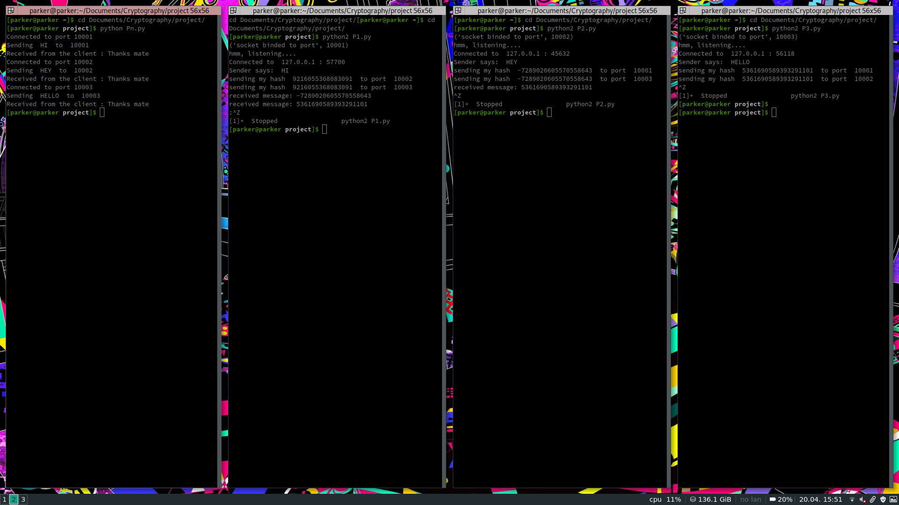

#AAAPDATEEEED:

Working

## Description and status

EACH NODE HAS DEDICATED PORT (except Pn)
here 10001 10002 10003

1)So,Pn sends using TCP to all ports **(DONE and WORKING)**

2)P1 recvs msg and generates it hash **(DONE and WORKING)**
  and shares its hash TO ALL NODES AT ONE. 
  **(DONE and only FEW ARE WORKING?!)** 
> P1 can receive from all other nodes but couldn't send to one.

> P2 can send it's hash to only one node and couldn't send to one.

> P3 can send to all other nodes but couldn't receive one.

REFER TO THE SCREENSHOT BELOW OF OUTPUT OF CURRENT PROGRAMS FOR BETTER UNDERSTANDING:

>The above step requires Multicast

~~>THIS MULTICASTING CODE IS COMPLEX AS FUCK AND I COULDN'T GET ONE WORKING~~

~~>FURTHUR, EVEN IF MULTICAST WORKS, WHEN A NODE MULTICASTS OTHER NODES SHOULDN'T. (SYNC PROBLEM)~~

~~>AN ALTERNATIVE FOR ABOVE STEP IS IT SENDS TO ALL NODES ONE BY ONE~~

~~>IT'S WON'T BE PROPER THIS WAY~~

~~>FOR EXAMPLE, IN CASE OF BLOCKCHAIN which is one of the applications of our protocol, ALL NODES WILL MULTICAST THEIR VALUES NOT ONE-BY-ONE.~~

3)Verify hash and print respective msg. **(WILL BE DONE EASILY and WILL BE WORKING)**

## YOU CAN
            COMPLETE THIS PIECE OF CODE
       or   FIND AND TRY AN ALTERNATIVE FOR ANY STEP OF THIS CODE
       or   WRITE A WHOLE NEW CODE
       or   ANYTHING YOU THINK WHICH MAKES SENSE :)
          
          
          
          
          
          
          
          
          
________________________________________________________________________
**Eeroju bus lo kuda try chesta**

